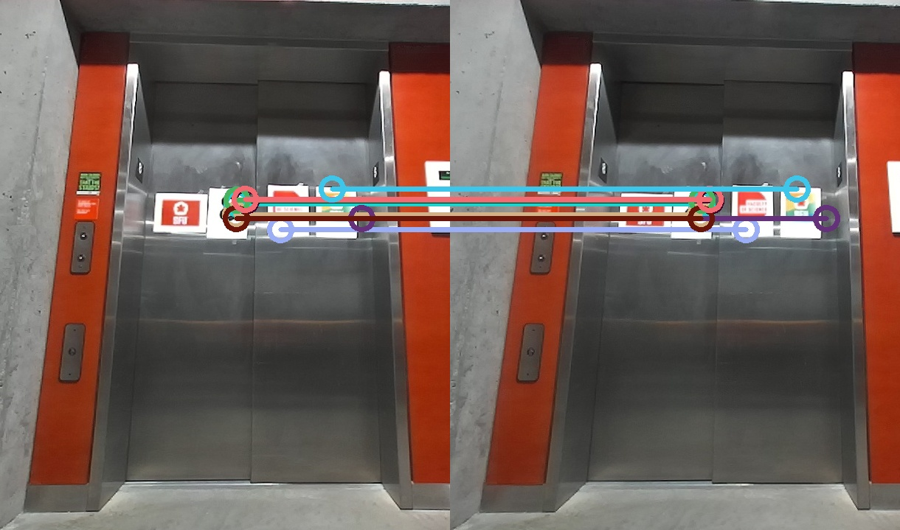

# Object pose estimation
This repository has been used in the ["Real-time Mapping of Multi-Floor Buildings Using Elevators"](https://ieeexplore.ieee.org/stamp/stamp.jsp?arnumber=9863407) 
which is presented at AIM 2022 conference.

The "object_3D_pose.py" is a ros node that publishes a list of 3D points of matched features of the objects. Also, you can edit the code to subscribe to a camera image topic.

## Requirements: 
1. The code inputs two images of an object with two different angles and a bounding box representing the location of the object on each image.
2. The positions of the camera in which the images are taken

## Example:


## Citation
If you happen to use the code for your research, please cite the following paper

```
@article{leisiazar2023mcts,
  title={An MCTS-DRL Based Obstacle and Occlusion Avoidance Methodology in Robotic Follow-Ahead Applications},
  author={Leisiazar, Sahar and Park, Edward J and Lim, Angelica and Chen, Mo},
  journal={arXiv preprint arXiv:2309.16884},
  year={2023}
}

```
